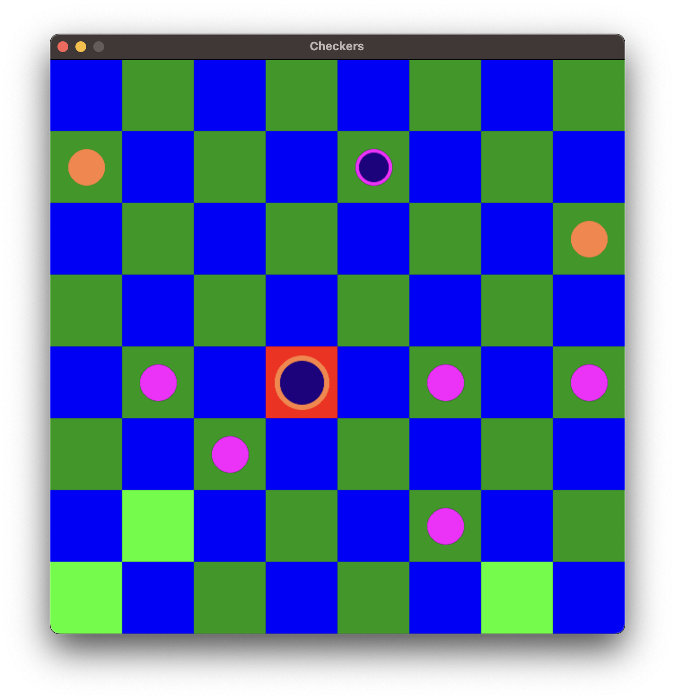

# Python Project

## Table of contents:
- [About](https://github.com/Plovel/PythonProject2/tree/dev#about)
- [Installation and Quick-Start](https://github.com/Plovel/PythonProject2/tree/dev#installation-and-quick-start)
  - [Installation](https://github.com/Plovel/PythonProject2/tree/dev#installation)
  - [Quick-Start](https://github.com/Plovel/PythonProject2/tree/dev#quick-start)
- [Known bugs](https://github.com/Plovel/PythonProject2/tree/dev#known-bugs)
- [To do](https://github.com/Plovel/PythonProject2/tree/dev#to-do)
- [Collaborators](https://github.com/Plovel/PythonProject2/tree/dev#collaborators)


## About
This project was made for Python Course in MIPT. Using this game, you can play checkers alone, with bot or with your firend on local network.
There are three available offline modes: Player vs Bot, Player vs Player (Manual mode), Bot vs Bot.
In multiplayer mode, by now, available opponent selection by setting up his 'ip address'.

You can manage the game sessions, you've played earlier. For example, you can save the game sessions into file and load them whenever you want.
With editing config menu, you can customize a bunch of settings (also supports file saves).




## Installation and Quick-Start

### Installation

If you are using MacOSX, install the game, using this command sequence:

```
git clone --branch dev git@github.com:Plovel/PythonProject2.git CheckersGame
cd CheckersGame
brew update
brew install python3
python3 -m ensurepip --upgrade
pip install -r requirentments.txt
./install.sh
./run.sh
```

If you are using Ubuntu (or other ubuntu-type system), install the game, using next command sequence:

```
git clone --branch dev git@github.com:Plovel/PythonProject2.git CheckersGame
cd CheckersGame
sudo apt-get update
sudo apt-get install python3
python3 -m ensurepip --upgrade
pip install -r requirentments.txt
./install.sh
./run.sh
```

If you want to get your ip address, you can use this:
  For Linux:
```
ip address
```
  For MacOSX: it's better just to go to "Details" menu of your current connection

### Quick-Start

You can use mouse navigation, but in the menus with buttons you can also use 'tab-enter' and arrows to navigate.
To see all the hotkeys, available in current menu, press 'X'.
T hotkey was created for fun, in this menu you can, for example, execute bash scripts; I don't pay much attention to this menu workability, use on your risk

## Known Bugs

### Network issues:

This part of the game conceptually isn't finished, so it can be inconvenient to use. There are a bunch of sockets crash cases were noticed, but it should't affect your game saves and config \(but if you really need your settings and sessions, it's better to save config and sessions files).

By now, multiplayer works as should, but sometimes connections may not be established correctly \(I guess because of small timeouts), but \(for me) in 100% cases just attempt to connect again works.

### Other issues:

The rest part of the game should be pretty stable. Serious functional bugs weren't noticed.

## To do
- \(Most likely it will be here always) Menu impovements
- Rework network mechanics (I wanted to set convenient menu for selecting players, without any IP changing by player; here should be used username and other player's map preview)
- By interrupting game process (like exiting session), by now, info about locked checker is lost (when you was eating, if you can eat more by the selected checker, you have to use the checker until you can't eat more)
- Smarter bot (added another bot behavior, but it's still too boring, thats why it's "alternative", not "hard")
- When a checker reach other side of the field by eating, it immediately can make long steps to eat more; I think it should't be so

## Collaborators
[Pavel Sidletskiy](https://t.me/vendor_vachupa)
